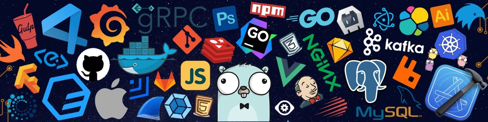

<h1 align="center"> Hello, I'm Ahsan Zamil  !</h1>

<h3 align="center">I'm a Frontend Developer from India ❤</h3>
  
A 20 Y/O Tech Enthusiast🎯 from India. I'm passionate about Software Development. I'm a passionate learner who's always willing to learn and work across technologies and domains 💡. I love to explore new technologies and leverage them to solve real-life problems✨. Apart from that I also love problem solving and solve algorithmic problems 👨🏻‍💻. I'm currently into Full Stack Development ⚒️ and working on my Data Structures and Algorithms skills 🚀.

 

-cyan)

- 🌱 I’m currently learning Backend and NextJs
- 👯 I’m looking to collaborate on Full Stack Projects
- 📫 How to reach me: You may follow me on [Linkedin](https://www.linkedin.com/in/ahsan-zamil/) 
- 😄 Pronouns: he/him/his
- ⚡ Fun fact: Dependent on Tutorials! 
 
 

   

## My Skill Set  
<table><tr><td valign="top" width="33%">

### Frontend  

  
  
  
  
  
  
  
  
  

</td><td valign="top" width="33%">

### Backend  

  
  
  
  
  
  
  
  
  

</td><td valign="top" width="33%">

### DevOps  

  
  
  
  
  

</td></tr></table>  

   

# 📊 GitHub Stats:
 
 

<!-- ## 🏆 GitHub Trophies
 -->

### 🔝 Top Contributed Repo

## My Featured Projects

1. **Oishi**: Oishi, a React.js-based food ordering website, seamlessly connects users with their favorite dishes through the live Swiggy API.
   [GitHub Repo](https://github.com/yourusername/project1) | [Hosted Site](https://yoursite.com/project1)

2. **E-commerce App**: An e-commerce application built with React and Redux, featuring a user-friendly interface for browsing and purchasing products.
   [GitHub Repo](https://github.com/yourusername/ecommerce-app) | [Hosted Site](https://yoursite.com/ecommerce-app)

3. **Netflix Clone**: A Netflix clone developed using React, showcasing similar functionalities such as user authentication, movie browsing, and playback.
   [GitHub Repo](https://github.com/yourusername/netflix-clone) | [Hosted Site](https://yoursite.com/netflix-clone)

4. **YouTube Clone**: This YouTube clone is built with React and utilizes the YouTube Data API, allowing users to search and watch videos in a familiar interface.
   [GitHub Repo](https://github.com/yourusername/youtube-clone) | [Hosted Site](https://yoursite.com/youtube-clone)

5. **Crypto Tracker App**: A cryptocurrency tracking application built with React and leveraging real-time data from cryptocurrency APIs, providing users with insights into market trends.
   [GitHub Repo](https://github.com/yourusername/crypto-tracker) | [Hosted Site](https://yoursite.com/crypto-tracker)

6. **Personal Portfolio**: My personal portfolio website, showcasing my projects, skills, and experiences. Built with React and styled with modern design principles.
   [GitHub Repo](https://github.com/yourusername/portfolio) | [Hosted Site](https://yoursite.com/portfolio)

## My Featured Blogs

- [Mastering React Hooks: A Comprehensive Guide](https://yourblog.com/post1)
- [Building Scalable React Applications with Redux](https://yourblog.com/post2)
- [Optimizing Performance in React: Tips and Best Practices](https://yourblog.com/post3)
- [Understanding React Context API: A Practical Overview](https://yourblog.com/post4)
- [Testing React Components: Strategies and Tools](https://yourblog.com/post5)
- [Next.js: Building Server-Side Rendered React Apps](https://yourblog.com/post6)

## 🏆 GitHub Trophies

 

### Show some ❤️ by starring ⭐ some of the repositories!
 
  

<h2 align="center">Reach me on </h2>

 

   
  
  
   

---
